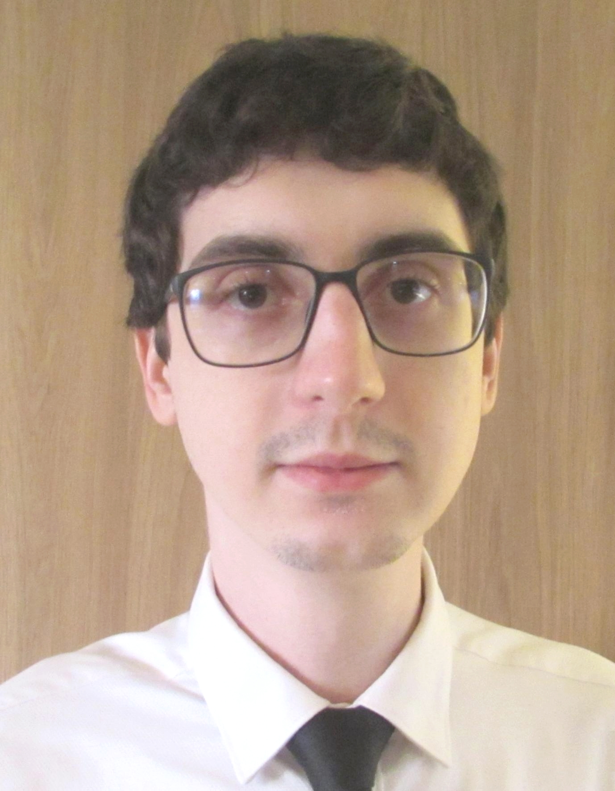

{: .profile-pic}

# Vinícius Gabriel Linden
Embedded Engineer | Firmware Developer

[viniciusglinden@protonmail.com](mailto:viniciusglinden@protonmail.com)
| [viniciuslinden.xyz](https://viniciusglinden.xyz)
{: .webaddress}

Full product development: from requirements to design through documentation,
prototyping, product & testing

### Skills

`Programming`
C, C++, Python, CMake, Rust, Kotlin, VHDL, Bash

`Tools`
Linux, RTOS, Gitlab, Continuous Integration (CI), PCB Design, SQL, REST, OpenAPI, Automation, Agile Methodology

## Occupation

`Mar 2024 - Present`
__Bridgecom Semiconductors GmbH__, Dresden, Germany
- _Senior Firmware Developer_
- Custom silicon for 5G User Equipment (UE)
- Infrastructure firmware development, RTOS
- Testing infrastructure framework (unit-test, simulation, on-chip)
- CI setup

`Feb 2024 - Feb 2024`
__ibp__, Dresden, Germany
- _Software Engineer_
- Python server design and implementation
- REST API specification with OpenAPI
- Unit and interface testing
- CI setup

`Jul 2021 - Jan 2024`
__nubix Software-Design GmbH__, Dresden, Germany
- _Hardware and Firmware Developer_
- Developed multiple projects
- Product requirements
- PCB design and prototyping
- Communication protocol specification, implementation and testing
- Project build automation
- FPGA planning and development
- CI setup

`Apr 2018 - Aug 2020`
__itt Chip__, São Leopoldo, Brazil
- _Engineer_
- Research project involving FPGA and Flash Memory
- Hardware component requirement estimation
- VHDL coding for FPGA
- Part of the Master thesis

`Mar 2018 - Apr 2018`
__ARGOS GROUP__, Canoas, Brazil
- _Electronics Designer_
- Contractor for AGCO Corporation
- Continuation of HIL lab

`Mar 2016 - Mar 2018`
__AGCO Corporation__, Canoas, Brazil
- _Intern_
- Newly created Hardware-In-the-Loop (HIL) lab
- Built and automated new HILs for agricultural machinery
- Machine software support
- Machine testing (in lab and in field)

`Sep 2015 - Jun 2016`
__Modelab, itt Chip__, São Leopoldo, Brazil
- _Undergraduate Student Researcher_
- Simulation with ANSYS tools
- Electromagnetic properties analysis

`Apr 2015 - Jun 2015`
__G2ELab__, Grenoble, France
- _Intern_
- Wrote Finite-Element Analysis software in Matlab
- Part of the Master I thesis

## Education

`Aug 2018 - Aug 2020`
__Unisinos University__, São Leopoldo, Brazil
- _Electrical Engineering Master Student_
- Publication on HDL architecture
- Full scholarship

`Feb 2014 - Jun 2015`
__Université Grenoble Alpes__, Grenoble, France
- _Master I Student_
- Électronique Électrotechnique et Traitement du Signal: Systèmes d'Énergie
  Électrique
- Full scholarship during graduation studies

`Feb 2012 - Aug 2018`
__Unisinos University__, São Leopoldo, Brazil
- _Electronic Engineering Graduate Student_

## Others

### Residence

Dresden, Germany

### Languages

`Professional level`
German, French

`Proficient level`
English, Portuguese

### Citizenship

EU, Brazilian

### Last update

2025-06-13

