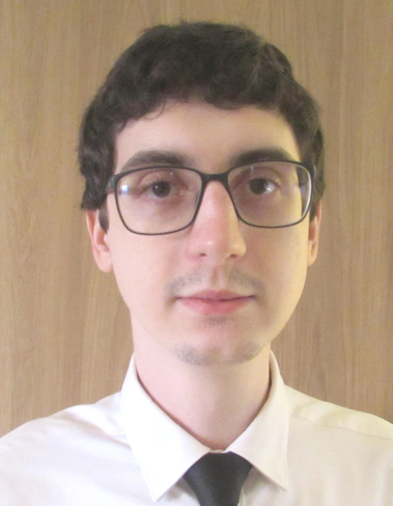

{: .profile-pic}

# Vinícius Gabriel Linden
Embedded Engineer | Firmware Developer

[viniciusglinden@protonmail.com](mailto:viniciusglinden@protonmail.com)
| [viniciuslinden.xyz](https://viniciusglinden.xyz)
| [linkedin.com/in/viniciusglinden](https://www.linkedin.com/in/viniciusglinden/)
{: .webaddress}

Full product development: from requirements to design through
 documentation, prototyping, product & testing

### Skills

`Programming`
C, C++, Python, CMake, Lua, Bash, Rust, Kotlin, VHDL

<!-- `Tools` -->
Linux, RTOS, Gitlab, Continuous Integration (CI), PCB Design, SQL,
 Docker, REST, OpenAPI, Automation, Agile Methodology, FPGA

## Occupation

`Mar 2024 - Present`
__Bridgecom Semiconductors GmbH__, Dresden, Germany
- _Senior Firmware Developer_
- Worked with custom silicon for 5G User Equipment (UE)
- Infrastructure firmware development in an RTOS context
  - Productive code worked in C, C++ with build written in CMake
  - Driver, maintaining and other supporting modules implementation
- Testing infrastructure framework (unit-test, simulation, on-chip)
  - Unit test done with C++ (Google Test) and Python (white box testing)
  - Simulation based on toolchain provider simulator coupled with RTL simulator
  - On-chip based on Lauterbach TRACE32 hardware debugger 
    and testing server implemented in Python running inside RTOS
- Gitlab CI changes and setup

<!--
`Feb 2024 - Feb 2024`
__ibp__, Dresden, Germany
- _Software Engineer_
- Python server design and implementation
- REST API specification with OpenAPI
- Unit and interface testing
- CI setup
-->

`Jul 2021 - Jan 2024`
__nubix Software-Design GmbH__, Dresden, Germany
- _Hardware and Firmware Developer_
- Developed multiple projects
  - IoT, industrial application, research
- Product requirements
  - Specified requirements, choose of hardware components, documentation
- PCB design and prototyping
  - PCB prototype developed in Eagle
- Communication protocol specification, implementation and testing
  - Designed a custom protocol for two microcontrollers integration
- Project build and documentation automation with Bash
- FPGA planning and development for an industrial DSP application
  - Full VHDL project developed on a Lattice FPGA
- CI setup
  - Both with Jenkins and Gitlab

`Apr 2018 - Aug 2020`
__itt Chip__, São Leopoldo, Brazil
- _Engineer_
- Research project involving FPGA and Flash Memory
- Hardware component requirement estimation
- VHDL coding for FPGA
- Part of the Master thesis

<!--
`Mar 2018 - Apr 2018`
__ARGOS GROUP__, Canoas, Brazil
- _Electronics Designer_
- Contractor for AGCO Corporation
- Continuation of HIL lab
-->

`Mar 2016 - Mar 2018`
__AGCO Corporation__, Canoas, Brazil
- _Intern_
- Newly created Hardware-In-the-Loop (HIL) lab
  - Testing software functionality, requirements and Functional Safety
- Built and automated new HILs for agricultural machinery
- Machine software support
- Machine testing (in lab and in field)

`Sep 2015 - Jun 2016`
__Modelab, itt Chip__, São Leopoldo, Brazil
- _Undergraduate Student Researcher_
- Simulation with ANSYS tools targeted for EMC reduction for a commercial
  product
- Electromagnetic properties analysis

`Apr 2015 - Jun 2015`
__G2ELab__, Grenoble, France
- _Intern_
- Wrote Finite-Element Analysis software in Matlab for motor vibration analysis
- Part of the Master I thesis

## Education

`Aug 2018 - Aug 2020`
__Unisinos University__, São Leopoldo, Brazil
- _Electrical Engineering Master Student_
- Publication on HDL architecture
- Full scholarship

`Feb 2014 - Jun 2015`
__Université Grenoble Alpes__, Grenoble, France
- _Master I Student_
- Électronique Électrotechnique et Traitement du Signal: 
  Systèmes d'Énergie Électrique
- Full scholarship during graduation studies

`Feb 2012 - Aug 2018`
__Unisinos University__, São Leopoldo, Brazil
- _Electronic Engineering Graduate Student_

## Others

### Residence

Dresden, Germany

### Languages

`Professional level`
German, French

`Proficient level`
English, Portuguese

### Citizenship

EU, Brazilian

<!--
### Last update

2025-06-16

-->
